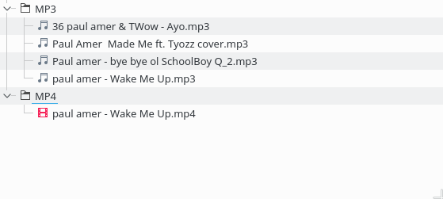

# Sorter

[](https://github.com/giantas/sorter/releases/latest)
[](https://github.com/giantas/sorter/issues)
[](https://saythanks.io/to/giantas)
[](https://t.me/giantas_sorter)


Sorter uses a custom search to help you organise files that contain similar names into their own folder. You can put all letters documents into one folder, all images with the name home into another, all music by one artist in yet another folder, etc. 

Sorter organises these files into folders which are grouped by the file types/formats. Sorter is able to recursively look into folders and their subfolders and filter out files that are of the same type (and name). The files are then moved to a different directory and can also be categorised into groups such as audio, video, and so on, as defined in [filegroups](filegroups.py)


## Download
[](http://file-sorter.sourceforge.io)

### Windows 7, 8, 10 (x86 & x64)

[](https://sourceforge.net/projects/file-sorter/files/v2.0.1/Sorter_2.0.1_Windows_x86_64.exe/download)


### OpenSUSE 42.1 x64 

[](https://sourceforge.net/projects/file-sorter/files/v2.0.1/Sorter_2.0.1_OpenSUSE42.1_x64.tar.gz/download)


### Ubuntu 16.04 x64 

[](https://sourceforge.net/projects/file-sorter/files/v2.0.1/Sorter_2.0.1_Ubuntu16.04_x64.tar.gz/download)


#### Broken link?
Download from [Sorter - SourceForge](http://file-sorter.sourceforge.io)

See the full list of supported OSes at [Sorter - Official Releases](https://github.com/giantas/sorter/releases/latest) (**recommended visit**)


## New Features Added
* **Custom search**: Search for file with names you only want e.g. enter "letter" into the search box and only files containing the word "letter" will be organised. What's more is that they will all be moved to a folder named "Letter".
	__This is an advantage for organising your songs, movies, etc__
* **Undo**: (reverse) is now possible. You can undo any unwanted file relocation!
* **Updates**: Check for updates regularly. Automatically check for updates any time your are connected to the Internet.
* And many [more](releases/latest)...


## Usage

Launch [Sorter GUI](releases/latest)


Choose source folder - folder in which files should be organised


Choose destination folder - where the files will be moved to - not required.


Select any (or all) option(s) - sort folders; recursive; types:

	* Sort folder - groups the file type folders into categories of audio, video, etc.

	* Recursive - checks inside folders and their subfolders for any files and organises them relative to the source folder.

	* Type - allows a user to select specific file types/format to be organised/sorted.

	* Search - enter the name to search for in the ajdacent box. Only files with this name will be organised/Sorted.


##### Types screen


##### Note

If option 'types' is not checked, by default, all files will be organised/sorted.


##### Click Run


*Resulting Folder*


*Resulting grouping*



#### Other screenshots 

##### New - Undo 


##### New - Update check 


##### When "search" is not included


#### Alternatively - clone repo

*Do*

git clone https://github.com/giantas/sorter.git

cd sorter

then 

```
python sorter.py
```

or 

```
python3 sorter.py
```

Then follow the GUI steps listed above.

## Warning
You should have access (read) and *write* permissions on the source and destination folders.
*Be careful* not to use sorter on application folders. ~~Sorter actions are *NOT* reversible (for now).~~
Sorter actions are now reversible.

### Prerequisites 
#### For the installer/binary [packages](releases/latest)
* None

#### For repo clone
* Python 3.x (3.4 recommended)
* [sqlite3](http://www.sqlite.org/download.html)


### Authors

* **[Giantas](https://github.com/giantas)** 


### License

* This project is licensed under the BSD 3-clause "New" or "Revised" License - see the [LICENSE](LICENSE) file for details


### TODO

[](https://saythanks.io/to/giantas)

[x] Add progress bar
[o] Add reverse for operations in history
